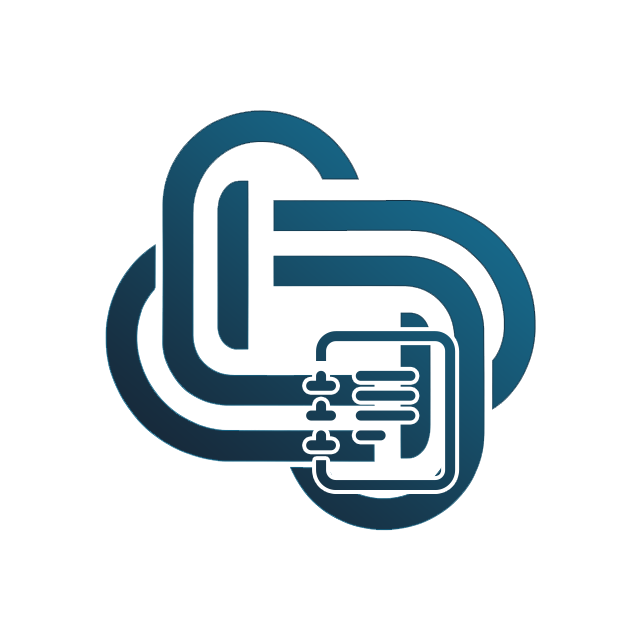

<p align="center"></p>

# coreLogger


## Description
The `coreLogger` class is a PHP library for logging messages to files. It supports logging at different levels of severity, including DEBUG, INFO, SUCCESS, WARNING, and ERROR. It also provides support for rotating log files, which can help manage file sizes and ensure that logs don't become too large.

## Features
  - Supports logging at different severity levels: DEBUG, INFO, SUCCESS, WARNING, and ERROR.
  - Rotates log files to manage file sizes.
  - Provides the ability to add, set, and list log files.
  - Supports logging to multiple files.
  - Supports logging ip addresses.

## License
This software is distributed under the [MIT](LICENSE) license.

## Requirements
* PHP >= 8.0

## Security
Please disclose any vulnerabilities found responsibly – report security issues to the maintainers privately. See [SECURITY.md](SECURITY.md) for more information.

## Installation
Using Composer:
```sh
composer require laswitchtech/core-logger
```

## How do I use it?
Review the [Documentation](docs/).
